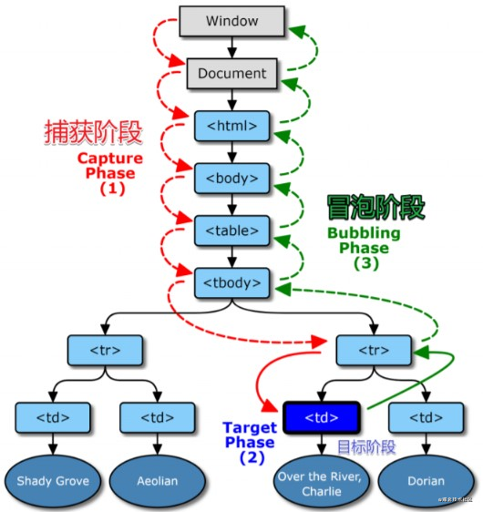

# DOM 事件模型或 DOM 事件机制
## 什么是DOM
文档对象模型 (DOM) 是HTML和XML文档的编程接口。它提供了对文档的结构化的表述，并定义了一种方式可以使从程序中对该结构进行访问，从而改变文档的结构，样式和内容。DOM 将文档解析为一个由节点和对象（包含属性和方法的对象）组成的结构集合。简言之，它会将web页面和脚本或程序语言连接起来。
## 什么是DOM事件
举例，click就是一个事件，可以在后面绑定函数执行功能。事件可以在文档(Document)结构的任何部分被触发，触发者可以是用户操作，也可以是浏览器本身。事件并不是只是在一处被触发和终止；他们在整个document中流动，拥有它们自己的生命周期。
## DOM事件模型和DOM事件机制
DOM事件模型本身就是解释元素有绑定函数执行顺序。

举例，图中[td]被点击，其上节点[tr]到[window]都可以加上onclick事件去执行函数。函数执行顺序分两种，从[window]到[tr]定义为捕获，从[tr]到[window]定义为冒泡。

## 如何选择事件执行顺序
```
可以通过addEventListener的第三个参数控制：
e.addEventListener('click',f2,true) // true按捕获方向执行函数
e.addEventListener('click',f2,false) // false按冒泡方向执行函数
```
## 阻止事件冒泡
e.stopPropagation()可以中断冒泡。 捕获无法取消。

## scroll事件不可阻止默认动作
阻止scroll默认动作没用，因先有滚动才有滚动事件，所以要阻止滚动
```
如何阻止滚动
css代码阻止滚轮

::-webkit-scrollbar {width: 0px!important}

//PC端阻止鼠标移动和滚轮
x.addEventListener('wheel', (e)=>{
  console.log(1)
  e.preventDefault()
}) //阻止鼠标移动
 
x.addEventListener('touchstart', (e)=>{
  console.log(2)
  e.preventDefault()
}) //手机端阻止触屏
```
